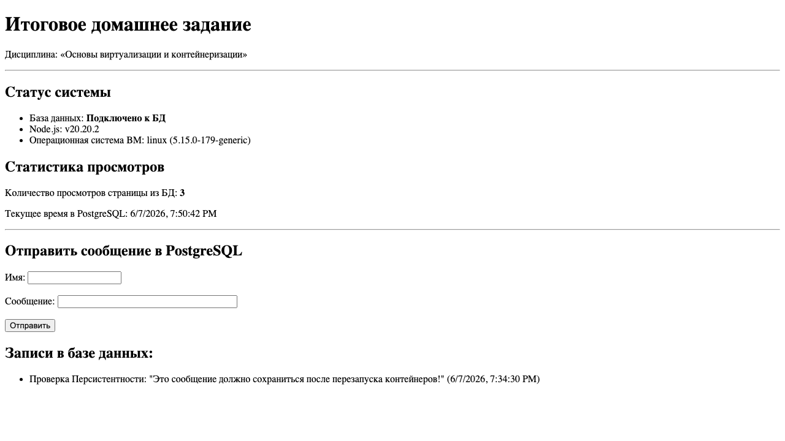

# Итоговое домашнее задание по курсу «Основы виртуализации и контейнеризации»

Данный проект содержит воспроизводимый сценарий развертывания виртуальной машины на базе Ubuntu Server 22.04 LTS с использованием **Multipass** (с автонастройкой через `cloud-init.yaml`), а также развертывание стека сервисов через Docker Compose: веб-приложение на Node.js, СУБД PostgreSQL и Nginx в качестве reverse proxy.

---

## 📸 Реальный скриншот работающего приложения

Веб-страница отображает системную информацию и интерактивную гостевую книгу, подключенную к PostgreSQL:



---

## 🛠️ Регламент запуска и воспроизведения

### Шаг 1. Создание виртуальной машины
Для автоматического развертывания используется Multipass. Запустите ВМ с параметрами **2 vCPU, 2 ГБ RAM, 20 ГБ диск** и мостом на физический интерфейс Wi-Fi `en0`:

```bash
multipass launch --name virtualization-final-homework --cpus 2 --memory 2G --disk 20G --cloud-init cloud-init.yaml --network en0 jammy
```

Файл `cloud-init.yaml` настроит пользователя `student` (пароль `student`, sudo-права, импорт ключа SSH), установит Docker/Compose и настроит ufw.

### Шаг 2. Подключение по SSH и копирование файлов
1. Узнаем IP-адрес ВМ (например, `192.168.31.236`):
   ```bash
   multipass list
   ```

2. Копируем файлы проекта на ВМ:
   ```bash
   tar -czf - docker-compose.yml nginx.conf .env app/ | ssh student@192.168.31.236 "mkdir -p ~/homework && tar -xzf - -C ~/homework"
   ```

### Шаг 3. Запуск стека через Docker Compose
Внутри ВМ перейдите в папку и запустите Docker Compose:
```bash
cd ~/homework
docker compose up -d
```

---

## 📝 Информация о выполнении (Логи)

### 1. Информация о ВМ (`hostnamectl` и `ip a`)

```bash
student@virtualization-final-homework:~$ hostnamectl
   Static hostname: virtualization-final-homework
       Icon name: computer-vm
         Chassis: vm
      Machine ID: fc893a21c6ac37968e7e39fc083794bf
         Boot ID: 1e39b6004454427da4908d853cee72da
  Virtualization: qemu
Operating System: Ubuntu 22.04.5 LTS
          Kernel: Linux 5.15.0-179-generic
    Architecture: arm64
 Hardware Vendor: QEMU
  Hardware Model: QEMU Virtual Machine
```

```bash
student@virtualization-final-homework:~$ ip a
1: lo: <LOOPBACK,UP,LOWER_UP> mtu 65536 qdisc noqueue state UNKNOWN group default qlen 1000
    inet 127.0.0.1/8 scope host lo
2: enp0s1: <BROADCAST,MULTICAST,UP,LOWER_UP> mtu 1500 qdisc fq_codel state UP group default qlen 1000
    inet 192.168.252.3/24 metric 100 brd 192.168.252.255 scope global dynamic enp0s1
3: enp0s2: <BROADCAST,MULTICAST,UP,LOWER_UP> mtu 1500 qdisc fq_codel state UP group default qlen 1000
    inet 192.168.31.236/24 metric 200 brd 192.168.31.255 scope global dynamic enp0s2
```

### 2. Доступ по SSH (подключение с хоста)
```bash
$ ssh student@192.168.31.236 "echo 'SSH Connection successful!'"
Warning: Permanently added '192.168.31.236' (ED25519) to the list of known hosts.
SSH Connection successful!
```

### 3. Версии Docker и Docker Compose
```bash
student@virtualization-final-homework:~$ docker --version
Docker version 29.5.3, build d1c06ef

student@virtualization-final-homework:~$ docker compose version
Docker Compose version v5.1.4
```

### 4. Запуск и статус контейнеров (`docker compose up -d` и `docker compose ps`)
```bash
student@virtualization-final-homework:~/homework$ docker compose up -d
[+] Running 4/4
 ✔ Network homework_app_network  Created                                   0.1s
 ✔ Container homework_db         Healthy                                   6.1s
 ✔ Container homework_web        Started                                   6.2s
 ✔ Container homework_proxy      Started                                   6.3s
```

```bash
student@virtualization-final-homework:~/homework$ docker compose ps
NAME             IMAGE                COMMAND                  SERVICE   CREATED          STATUS                    PORTS
homework_db      postgres:15-alpine   "docker-entrypoint.s…"   db        11 seconds ago   Up 11 seconds (healthy)   5432/tcp
homework_proxy   nginx:alpine         "/docker-entrypoint.…"   proxy     11 seconds ago   Up 6 seconds              0.0.0.0:80->80/tcp, [::]:80->80/tcp
homework_web     homework-web         "docker-entrypoint.s…"   web       11 seconds ago   Up 6 seconds              3000/tcp
```

### 5. Проверка доступности по HTTP с хоста (`curl -I`)
```bash
$ curl -I http://192.168.31.236/
HTTP/1.1 200 OK
Server: nginx/1.31.1
Date: Sun, 07 Jun 2026 16:34:25 GMT
Content-Type: text/html; charset=UTF-8
Connection: keep-alive
X-Powered-By: Express
```

---

## 💾 Проверка персистентности базы данных

1. Добавление записи:
   ```bash
   $ curl -X POST -H "Content-Type: application/json" -d '{"name": "Проверка", "message": "Проверка персистентности!"}' http://192.168.31.236/api/guestbook
   {"id":1,"name":"Проверка","message":"Проверка персистентности!","created_at":"2026-06-07T16:34:30.607Z"}
   ```

2. Статистика:
   ```bash
   $ curl http://192.168.31.236/api/stats
   {"status":"success","dbConnected":true,"totalViews":1,"dbTime":"2026-06-07T16:34:35.944Z","environment":{"nodeVersion":"v20.20.2","platform":"linux","osRelease":"5.15.0-179-generic"}}
   ```

3. Удаление и перезапуск стека:
   ```bash
   student@virtualization-final-homework:~/homework$ docker compose down
   student@virtualization-final-homework:~/homework$ docker compose up -d
   ```

4. Проверка сохранения данных в БД:
   ```bash
   $ curl http://192.168.31.236/api/guestbook
   [{"id":1,"name":"Проверка","message":"Проверка персистентности!","created_at":"2026-06-07T16:34:30.607Z"}]

   $ curl http://192.168.31.236/api/stats
   {"status":"success","dbConnected":true,"totalViews":2,"dbTime":"2026-06-07T16:35:06.750Z","environment":{"nodeVersion":"v20.20.2","platform":"linux","osRelease":"5.15.0-179-generic"}}
   ```
   *Данные успешно сохранены во внешнем томе.*
